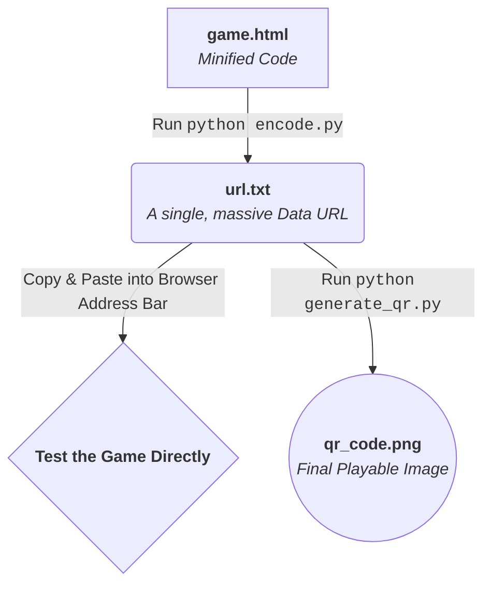

# Web Game in a QR Code

This project is a showcase of extreme optimization, containing two key things:

1. **A fully playable "Lights Out" game** written in HTML, CSS, and JavaScript, painstakingly minified to fit within the tight constraints of a QR code.
2. **A set of simple Python scripts** that let you package that game, or any other small web project, into a single, scannable QR code that runs offline.

The goal is to create a true "scan-and-play" experience without needing a web server or internet connection.

## How It Works: From Code to a Playable QR Code

The magic of this project is turning a standard HTML file into a picture. Here's the journey from start to finish in plain English.

**Step 1: Start with a Web Page**
We begin with a normal HTML file (`ind.html` in our example) that contains all the code for the game: HTML for structure, CSS for style, and JavaScript for logic.

**Step 2: Minify the Code**
To have any chance of fitting our game into a QR code, we must make it as small as possible. This involves removing all comments, extra spaces, and shortening variable names. This process, called "minification," gives us our final, tiny `game.html` file.

**Step 3: Encode It into a Single Line of Text**
This is where `encode.py` comes in. It takes the contents of `game.html` and converts it into a **Data URL**. This is a very long string of text that starts with `data:text/html;base64,` and contains the entire webpage encoded within it. The result is saved to `url.txt`. Now you can just copy this url and paste into any web browser and you'll be able to play the game directly, and test it out.

**Step 4: Turn the Text into a QR Code**
The final step uses `generate_qr.py`. This script takes that giant text string from `url.txt` and generates a QR code image from it. A QR code is just a visual representation of text, and in our case, that text happens to be a fully functional web page.

### The Workflow at a Glance



## The Challenge: Size Is Everything

QR codes come in different sizes (**Versions**, from 1 to 40) and have four levels of **Error Correction**. This feature allows a code to be partially damaged and still be readable. For our purpose, storing as much code as possible, **Error Correction Level L (Low)** is the best choice.

The table below shows how the QR code's capacity translates into the maximum size for your minified HTML file, accounting for the ~33% size increase from Base64 encoding.

| QR Version | Error Level | Total Characters (Approx.) | **Estimated Max HTML File Size (Bytes)** | Notes |
| :--- | :--- | :--- | :--- | :--- |
| Version 25 | L | 1,196 | **~880 bytes** | Good for smaller projects. |
| Version 30 | L | 1,555 | **~1,150 bytes** | A common, reliable upper limit. |
| Version 35 | L | 2,189 | **~1,625 bytes** | Getting dense, might be harder to scan. |
| **Version 40** | **L** | **2,953** | **~2,200 bytes** | **The absolute maximum.** |
| Version 40 | M | 2,331 | **~1,730 bytes** | Max capacity with medium error check. |

***Disclaimer:*** *These file sizes are ballpark estimates. For best results, aiming for a file size that produces a Version 35 code or smaller is a safe bet. Pushing to the absolute Version 40 limit creates a very dense code that some phone cameras may struggle with.*

## How to Package Your Own Project

Now that you understand the process, here's how to do it yourself. The scripts are reusable for any project that follows the folder structure.

### Prerequisites

You need Python 3 and the `qrcode` library.

```bash
pip install qrcode[pil]
```

### The 3-Step Process

#### Step 1: Structure Your Project

Create a folder for your project. Inside it, create an `html` folder and place your single, self-contained, and minified HTML file named `game.html` inside it.

```
<your_project_name>/
└── html/
    └── game.html
```

#### Step 2: Encode the HTML

Run the `encode.py` script from your terminal, telling it which project folder to use.

```bash
# General Usage
python encode.py <your_project_name>

# Example for a project named 'snake_game'
python encode.py snake_game
```

#### Step 3: Generate the QR Code

Now, run the `generate_qr.py` script with the same project name.

```bash
# General Usage
python generate_qr.py <your_project_name>

# Example for 'snake_game'
python generate_qr.py snake_game
```

This creates the final `img/qr_code.png` in your project folder. Scan it and play!

---

## Example Project: The "Lights Out" Game

This repository includes a working example, `lights_out`.

* `lights_out/html/ind.html`: The original, human-readable source code with comments.
* `lights_out/html/game.html`: The heavily minified version used for the final QR code.

To package this game yourself, run:

```bash
python encode.py lights_out
python generate_qr.py lights_out
```

---

## The Scripts Explained

* **`encode.py`**: Reads `<project>/html/game.html`, encodes it to Base64, and saves it as a Data URL in `<project>/url/url.txt`.
* **`generate_qr.py`**: Reads the Data URL from the text file and generates a scannable `qr_code.png` image.
* **`decode.py`**: A helper script for checking your work. It takes a Data URL and decodes it back into a readable HTML file so you can confirm the encoding was successful.
